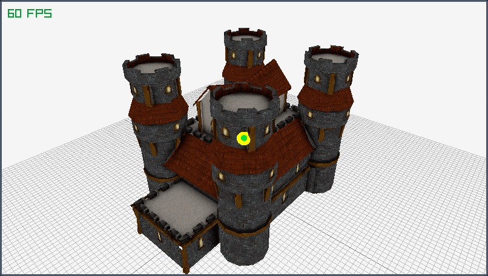
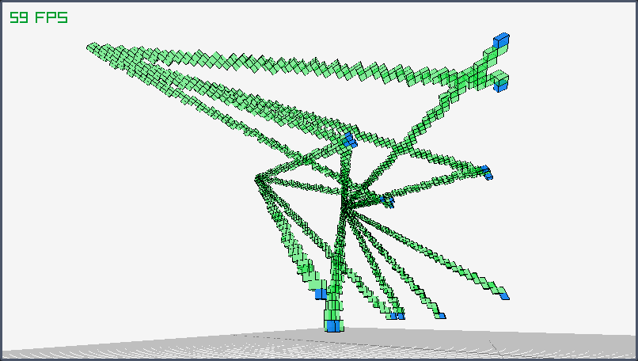

# README

Software to create and read octree structures using `raylib` and `octomap`.

## Instructions 

There's two programs:

- `octomap-sim-ray`: Allows us to create `.bt` files by loading a model and simulating a sensor to insert a ray
- `octomap-viz`: Allows us to load `.bt` files containing an `octree`

### octomap-sim-ray

Launch the program where you have the `res/` directory with the model to load (configured in the code).
If the model could be loaded correctly, you can start casting rays from the position of the camera by clicking with the left button of your mouse.
The program outputs a file called `test.bt` that can be loaded in the visualizer.

> In the picture, you can see a model of a castle loaded. 
> The green dot is the center of the screen and where the ray will be cast.
> The yellow sphere is where the ray intersects the model.

### octomap-viz

Launch the program with the file to load as argument.
Key toggles:

- `NUMPAD + or -`: Increase or reduce the tree resolution
- `F`: Draw the free voxels
- `P`: Draw the wires of the parent nodes
- `G`: Draw the square grid

> In the next picture you can see a few insertions made using the previous program.
> Green voxels are empty space and blue ones occupied.

## TODO

- Load model and `octree` on the same program
- Add a menu interface to load and save
- Add a UI to toggle options and set parameters
- Generate more rays to fulfill more complex sensor models
- Try generating a depth camera by simulating two cameras and a disparity map

## Versions

- Raylib: `raylib 4.6-dev`
- Octomap: `octomap v1.9.6`